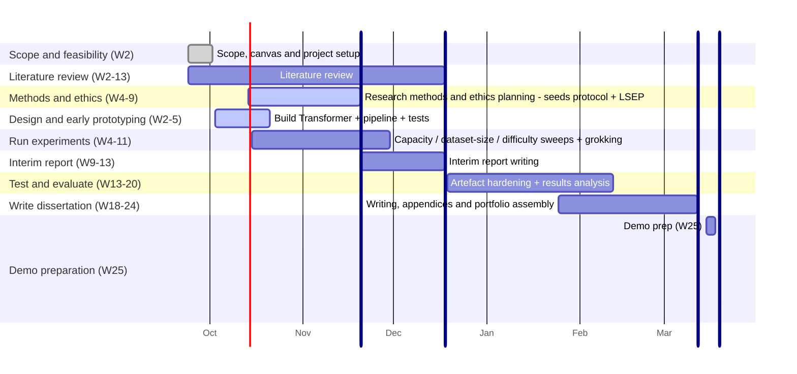

# TinyLM Lab - Whole-Project Plan

**Status:** Draft - prepared for the Wed 14 Oct supervisor meeting. Module-week milestones come from the module handbook/W1 slides and are authoritative; calendar estimates for phases are my own deadlines.

**Research question (full canvas RQ):** how do model capacity, dataset size and task difficulty affect memorisation, generalisation and overfitting in miniature Transformers? The experiment programme runs all three factors as mainline one-factor-at-a-time series (≥3 seeds each) with a grokking hunt, all on the same framework. Bar: maximally impressive at every step - effort is not the constraint. The dataset-size series alone still answers the RQ with the same framework, so the programme is guaranteed deliverable under any outcome.

---

## Module Assessed Deliverables

| Module week | Deliverable | Weight |
| --- | --- | --- |
| Week 9 | Ethics / LSEP declaration form | 0% (but required) |
| Week 13 | Interim report (literature review + project plan) | 5% |
| Week 24 (Fri 12:00) | Final portfolio - written report 15-35 pages incl. references + artefact codebase + appendices (ethics materials, visuals, engineering docs) | 95% |
| Week 25 | Demo: 5 min + 10 min Q&A | pass/fail |

Supervisor meetings: fortnightly, Wednesdays 13:30.

## Phase plan

| Phase | When (calendar) | Output |
| --- | --- | --- |
| Framework core - Transformer + minimal pipeline (early build) | Sat 3 - Wed 21 Oct 2026 (started the day after meeting 1; final week overlaps the experiment start for insurance) | One command → train → metrics → plot; tests green incl. CPU seed repro; Complete for meeting 2 with John |
| Reading & literature grounding | done 2026-10-03; continued engagement feeds the interim | 17 sources annotated in Zotero (claim - evidence - supports - cautions each); interim lit review should just be assembly work |
| Experiments - capacity × dataset size × task difficulty + grokking | mid-Oct - end Nov 2026 | Three one-factor-at-a-time sweeps × ≥3 seeds on the same framework: capacity (depth/width grid at fixed dataset size), dataset size (~64/256/512/1024), task difficulty (period-2 → period-4 → modular arithmetic); grokking runs on the modular-arithmetic thread; gap-vs-factor comparisons; regularisation series (dropout/weight decay) as the fourth thread if compute allows (the regularisation question from the project canvas); honest failure log; any stalling thread → decision with supervisor |
| Interim report (Week 13) | late Nov - mid Dec 2026 | Lit review + this project plan, refined; 5% submission |
| Testing & evaluation | Jan - mid Feb 2027 | Artefact hardening (edge cases, CPU/MPS parity, longer/more runs); sweep analysis: gap-vs-factor plots across all three series, seeds-≥3 error bars, limitations; negative results reported honestly |
| Dissertation writing | late Jan - mid Mar 2027 | Report + appendices (configs, logs, plots, attention heatmaps as evidence) |
| Final portfolio (Week 24) | Fri 12:00, Week 24 | 95% of grade |
| Demo prep + delivery (Week 25) | mid-Mar 2027 | 5-min demo + Q&A; every submitted claim explainable live |

## How the plan maps to the marking criteria (research track)

| Criterion | Where the plan earns it |
| --- | --- |
| RQ, rationale, literature (25%) | Reading programme + interim lit review + rationale for the full three-factor RQ |
| Research design & rigour (25%) | Seeded, tested, reproducible pipeline; ≥3 seeds per config; guaranteed floor (dataset-size series); honest reporting |
| Artefact design & implementation (20%) | Framework: own-implementation Transformer, one-command reproducibility, inspectable attention |
| Analysis & conclusions (20%) | Three-factor sweep analysis (capacity × dataset size × task difficulty), gap quantification, grokking evidence (or bounded non-observation, reported honestly), negative results as findings |
| Dissertation quality (10%) | Writing window W20-23, appendices generated by the framework itself |

Every criterion's upper bands (both portfolio rubrics) explicitly reward legal, social, ethical and professional treatment, and the interim-report rubric has a dedicated "Professional considerations" criterion. The section below is the standing LSEP record the dissertation and interim report draw on - kept current as the project runs.

## Legal, social, ethical and professional considerations (LSEP)

- **Legal:** the artefact is own implementation on PyTorch primitives; PyTorch (BSD-style licence) is the only third-party dependency, so there is no licence contamination in the shipped code. The repo is MIT-licensed and public; nothing is copied, and all data is generated in-house - no reuse rights or data-protection law engaged at all.
- **Social / human impact:** synthetic data only - no human participants and no personal data of any kind, by construction. Week 14's "user engagement" stage is therefore inapplicable and no full ethics application is expected; the LSEP declaration is submitted in Week 9. Because every datapoint is generated from documented rules, conclusions cannot overstate what a model learned from unexamined data - a common failure mode in applied ML that this design rules out.
- **Environmental:** the entire programme runs on one laptop - models ≤ ~1M parameters, runs of minutes, not GPU-hours. The compute footprint is negligible (documented in the appendices), and no cloud or university GPU time is a hidden dependency.
- **Honest reporting (research integrity):** all runs are logged including failed and negative ones; every claim in the report is backed by a logged metric or an inspection artefact (e.g. attention heatmaps); results are reported with seeds-≥3 spread and limitations named. "Grokking did not appear at this scale" is a finding, not a failure - the guaranteed floor (dataset-size series) answers the RQ regardless. README and write-up state the held-out mechanism honestly: no pattern-to-pattern mapping exists, but a general copying rule could solve validation - memorisation is the expectation, and a rising validation curve would be reported as a finding, not dressed up or hidden.
- **Professional practice:** reproducible by construction (pinned lockfile, fixed seeds, bit-exact CPU repro test); accessible, non-proprietary outputs (JSONL/CSV logs, colour-blind-safe matplotlib plots); every submitted claim explainable live at the demo - the ownership-and-authorship bar is met by design, not by assertion.

## Constraints the plan respects

- **Laptop-first:** Apple Silicon MPS, models ≤ ~1M params, runs ≤ a few minutes. University compute pursued opportunistically only. This is the physical envelope (John: laptop only) - maximisation means more series, more seeds, more rigour inside it, not bigger models.
- **Scope discipline:** the parking lot holds tooling and UI only (dashboard, W&B, distributed anything); it never holds experiment series - all three RQ factors run.
- **Guaranteed floor (formerly Plan B):** the dataset-size series alone answers the RQ with the same framework, same plots - whatever happens to the other threads.

## Known risks

| Risk | Mitigation |
| --- | --- |
| Grokking doesn't appear within the experiment window | The three sweep series run regardless on the identical framework - no time lost; bounded non-observation reported honestly |
| MPS nondeterminism | Reproducibility pinned on CPU (bit-exact test); stated honestly in README |
| Time slips (job applications, other modules) | Cut eval granularity and polish items - never the Transformer itself; parking lot absorbs scope creep |
| Interim (Week 13) collides with experiment phase | Interim content = already-produced material (lit review + this plan), not new work |

## Timeline (Gantt)

Dates below are my working estimates; module-week numbers are authoritative. Supervisor meetings run fortnightly (Wed 13:30) in the background - charted here are the project phases and module deliverables only.

Reading the chart: section headings follow the module's own suggested project-cycle stages; four dark vertical bars mark the module submission deadlines (LSEP W9, interim W13, portfolio W24, demo W25) - 1-day crit-tagged tasks, since mermaid has no true vertical-line feature; the thin red line is today's date (todayMarker). Parallel bars show what a period contains, not what to do simultaneously at full effort. The chart shows the intended path; the guaranteed floor if any thread stalls is documented in the risks table.

## How the plan covers the module's project cycle (W1 welcome slides)

| Module teaching timeline | Where it happens in this plan |
| --- | --- |
| W1 - project allocated, welcome | Done: canvas + first supervisor meeting |
| W2-3 - literature review | Reading programme complete (2026-10-03): 17 sources annotated in Zotero; continued engagement feeds the interim report; framework prototype build starts (early prototyping) |
| W4-6 - research methods & ethics | Method decisions settled in the experiment design spec; ethics stance agreed (no human data); prototype + pipeline + tests complete for meeting 2 with supervisor |
| W7-8 - academic writing | Workshops + the LOG.md habit; sustained writing starts with the interim report |
| W9 - ethics due | LSEP form, **due ≈ 20 Nov**; content pre-agreed, submitted as soon as the form is available |
| W10-12 - no timetabled session | Project work: experiments wrap up (end of Nov); interim report written |
| W13 - interim report | Interim report (5%), **due ≈ mid-Dec** |
| W14 - user engagement can begin | Not applicable - synthetic data only, no human participants or personal data by design |
| W15 - software testing | Artefact testing & hardening (Jan) |
| W16-17 - writing final report | Dissertation writing window opens (late Jan) |
| W18-23 - continued writing/analysis | Analysis conclusions + dissertation drafting |
| W24 - dissertation due | Final portfolio, **due ≈ 12 Mar** |
| W25 - demos | Demo + Q&A, **due ≈ 19 Mar** |

Marking process (for reference): supervisor and second marker grade the portfolio independently; the average is the grade; a moderator is appointed if the two differ by 3+ grade points or across pass/fail.
