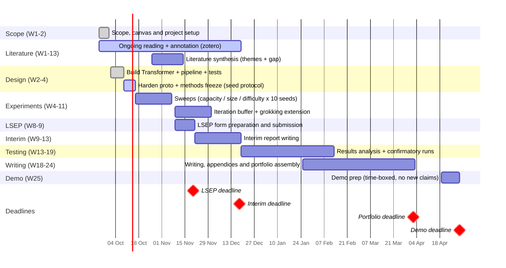

# TinyLM Lab - Whole-Project Plan

**Status:** Live - prototype-spec.md completed, prototype-hardening next

**Research question (full canvas RQ):** how do model capacity, dataset size and task difficulty affect memorisation, generalisation and overfitting in miniature Transformers? The experiment programme runs all three factors as mainline one-factor-at-a-time series (10 seeds each) with a grokking hunt, all on the same framework. Bar: maximally impressive at every step - effort is not the constraint. The dataset-size series alone still answers the RQ with the same framework, so the programme is guaranteed deliverable under any outcome.

---

## Module Assessed Deliverables

| Module week | Deliverable | Weight |
| --- | --- | --- |
| Week 9 | Ethics / LSEP declaration form | 0% (but required) |
| Week 13 | Interim report (literature review + project plan) | formative feedback only (0% grade) |
| Week 24 (Fri 02 Apr 12:00) | Final portfolio - written report 15-35 pages incl. references + artefact codebase + appendices (ethics materials, visuals, engineering docs) | 100% |
| Week 25 (≈ Fri 30 Apr, exam weeks 25-28) | Demo: 5 min + 10 min Q&A | pass/fail |

Supervisor meetings: fortnightly, Wednesdays 13:30.

## Phase plan

| Phase | When (calendar) | Output |
| --- | --- | --- |
| Framework core - Transformer + minimal pipeline (early build) | 3 Oct - 8 Oct (6d) | One command → train → metrics → plot; tests green incl. CPU seed repro; supervisor meeting 2 (14 Oct) demos the proto-spec. Hardening 9-15 Oct (7d, ends day before sweeps start 16 Oct); contingency is the iteration buffer to 30 Nov. |
| Reading & literature grounding | 24 Sep - 18 Dec (ongoing, feeds interim report, due 18 Dec) | sources collected in Zotero; page-anchored annotations from 8 Oct; synthesis (theme statements + gap) late Oct - mid Nov. |
| Experiments - capacity × dataset size × task difficulty + grokking | Core sweeps 16 Oct - 6 Nov (~12 machine-hours over ~3 wks incl. reruns; measured ~6 min/axis at 500 steps, 12h is buffer for 10k-step grokking + reruns; starts after hardening ends 15 Oct); iteration buffer + grokking extension to 30 Nov | Three one-factor-at-a-time sweeps × 10 seeds on the same framework: capacity (depth/width grid at fixed dataset size), dataset size (~64/256/512/1024), task difficulty (period-2 → period-4 → modular arithmetic); pilot val per-config fresh overlapping, final curve uses fixed common val; grokking runs on the modular-arithmetic thread; gap-vs-factor comparisons; regularisation series (dropout/weight decay) as the fourth thread if compute allows (the regularisation question from the project canvas); honest failure log; any stalling thread → decision with supervisor |
| Interim report (Week 13) | late Nov - mid Dec | Project plan (written) + first lit-review synthesis draft (context / themes / closest work / gap) - dull but needed, synthesis work; formative feedback only (0% grade) |
| Testing & evaluation | Jan - mid Feb (continuous) | Final confirmatory runs (edge cases, CPU/MPS parity, longer/more runs); sweep analysis: gap-vs-factor plots across all three series, 10-seed error bars, limitations; pilot validation per-config fresh overlapping, final curve uses fixed common val; negative results reported honestly |
| Dissertation writing | late Jan - early Apr (to W24 Fri 02 Apr; overlaps testing to 12 Feb - analysis as runs land) | Report + appendices (configs, logs, plots) |
| Final portfolio (Week 24) | Fri 02 Apr 12:00, Week 24 | 100% of grade |
| Demo prep + delivery (Week 25) | 19-30 Apr (≈ Fri 30 Apr delivery; spans pre-exam + exam weeks 25-28) | 5-min demo + Q&A; every submitted claim explainable live; prep time-boxed, no new claims |

## How the plan maps to the marking criteria (research track)

| Criterion | Where the plan earns it |
| --- | --- |
| RQ, rationale, literature (25%) | Reading programme + interim lit review + rationale for the full three-factor RQ |
| Research design & rigour (25%) | Seeded, tested, reproducible pipeline; 10 seeds per config; guaranteed floor (dataset-size series); honest reporting |
| Artefact design & implementation (20%) | Framework: own-implementation Transformer, one-command reproducibility, inspectable attention |
| Analysis & conclusions (20%) | Three-factor sweep analysis (capacity × dataset size × task difficulty), gap quantification, grokking evidence (or bounded non-observation, reported honestly), negative results as findings |
| Dissertation quality (10%) | Writing window W18-24 (to Fri 02 Apr; overlaps testing 25 Jan-12 Feb intentionally - analysis as runs land), appendices generated by the framework itself |

Every criterion's upper bands (both portfolio rubrics) explicitly reward legal, social, ethical and professional treatment, and the interim-report rubric has a dedicated "Professional considerations" criterion. The section below is the standing LSEP record the dissertation and interim report draw on - kept current as the project runs.

## Legal, social, ethical and professional considerations (LSEP)

- **Legal:** the artefact is own implementation on PyTorch primitives; PyTorch (BSD-style licence) is the only third-party dependency, so there is no licence contamination in the shipped code. The repo is MIT-licensed and public; nothing is copied, and all data is generated in-house - no reuse rights or data-protection law engaged at all.
- **Social / human impact:** synthetic data only - no human participants and no personal data of any kind, by construction. Week 14's "user engagement" stage is therefore inapplicable and no full ethics application is expected; the LSEP declaration is submitted in Week 9. Because every datapoint is generated from documented rules, conclusions cannot overstate what a model learned from unexamined data - a common failure mode in applied ML that this design rules out.
- **Environmental:** the entire programme runs on one laptop - models ≤ ~2M parameters, runs of minutes, not GPU-hours. The compute footprint is negligible (documented in the appendices), and no cloud or university GPU time is a hidden dependency.
- **Honest reporting (research integrity):** all runs are logged including failed and negative ones; every claim in the report is backed by a logged metric or an inspection artefact; results are reported with 10-seed spread and limitations named. "Grokking did not appear at this scale" is a finding, not a failure - the guaranteed floor (dataset-size series) answers the RQ regardless. README and write-up state the held-out mechanism honestly: no pattern-to-pattern mapping exists, but a general copying rule could solve validation - memorisation is the expectation, and a rising validation curve would be reported as a finding, not dressed up or hidden.
- **Professional practice:** reproducible by construction (pinned lockfile, fixed seeds, bit-exact CPU repro test); accessible, non-proprietary outputs (JSONL/CSV logs, colour-blind-safe matplotlib plots); every submitted claim explainable live at the demo - the ownership-and-authorship bar is met by design, not by assertion.

## Constraints the plan respects

- **Laptop-first:** Apple Silicon laptop, CPU canonical (bit-exact + CI-compatible; MPS measures faster but is nondeterministic, so it is opt-in only). Capacity headroom extends the capacity-sweep axis but stays under the ≤2M ceiling - a deliberate choice (the result is more impressive at small scale), not a backend limit.
- **Scope discipline:** the parking lot holds tooling and UI only (dashboard, W&B, distributed anything); it never holds experiment series - all three RQ factors run.
- **Guaranteed floor (formerly Plan B):** the dataset-size series alone answers the RQ with the same framework, same plots - whatever happens to the other threads.

## Known risks

| Risk | Mitigation |
| --- | --- |
| Grokking doesn't appear within the experiment window | The three sweep series run regardless on the identical framework - no time lost; bounded non-observation reported honestly |
| MPS nondeterminism | MPS measures faster than CPU but is nondeterministic, so the bit-exact guarantee is pinned on CPU (`test_cpu_repro`); MPS stays opt-in for the parity check; stated honestly in README |
| Time slips (job applications, other modules) | Cut eval granularity and polish items - never the Transformer itself; parking lot absorbs scope creep |
| Interim (Week 13) collides with exams (07-18 Dec) + experiment tail | Interim is formative (0%) so its floor is a first draft, not polish; lit synthesis completes mid-Nov (themes + gap) and drafting front-loads to ≈ 04 Dec (Fri; draft v1 milestone), so 06-18 Dec stays buffer only |
| Demo (Week 25) sits in exams (26 Apr-21 May) | Demo is a 5-min reproducible one-command run + Q&A on already-submitted claims; prep time-boxed to ~2 weeks (19-30 Apr), no new claims |

## Timeline (Gantt)

Dates below are my working estimates; module-week numbers are authoritative. W24/W25 labels are nominal module weeks (which skip vacation weeks - continuous count would run ~W28/W29); the calendar deadlines Fri 02 Apr and Fri 30 Apr govern. Supervisor meetings run fortnightly (Wed 13:30) in the background - charted here are the project phases and module deliverables only.

Reading the chart: section headings are short labels (full phase names in the table above); four red diamonds mark the module submission deadlines (LSEP W9, interim W13, portfolio W24, demo W25). Overlaps are intentional: hardening includes the methods freeze (seed protocol, freeze-before-sweeps); sweeps overlap synthesis from 26 Oct with effort prioritised to sweeps once they start; dissertation overlaps testing 25 Jan-12 Feb (analysis as runs land); testing runs continuously 19 Dec-12 Feb with no Christmas pause. Parallel bars show what a period contains, not what to do simultaneously at full effort. The chart shows the intended path; the guaranteed floor if any thread stalls is documented in the risks table.

## How the plan covers the module's project cycle (W1 welcome slides)

| Module teaching timeline | Where it happens in this plan |
| --- | --- |
| W1 - project allocated, welcome | Done: canvas + first supervisor meeting |
| W2-3 - literature review | First-hand annotation of the 18 Zotero sources + synthesis (context / themes / closest work / gap) running through to the interim report; framework prototype build starts (early prototyping) |
| W4-6 - research methods & ethics | Method decisions settled in the experiment design spec; ethics stance agreed (no human data); proto-spec demoed at meeting 2 (14 Oct) |
| W7-8 - academic writing | Workshops + the LOG.md habit; sustained writing starts with the interim report |
| W9 - ethics due | LSEP form, **due Fri 20 Nov**; content pre-agreed, submitted as soon as the form is available |
| W10-12 - no timetabled session | Project work: experiments wrap up (end of Nov); interim report written |
| W13 - interim report | Interim report (formative feedback, 0%), **due Fri 18 Dec** |
| W14 - user engagement can begin | Not applicable - synthetic data only, no human participants or personal data by design |
| W15 - software testing | Artefact testing & hardening (Jan) |
| W16-17 - writing final report | Dissertation writing window opens (late Jan) |
| W18-23 - continued writing/analysis | Analysis conclusions + dissertation drafting |
| W24 - dissertation due | Final portfolio, **due Fri 02 Apr 12:00** |
| W25 - demos | Demo + Q&A, **≈ Fri 30 Apr (exam weeks 25-28)** |

Marking process (for reference): supervisor and second marker grade the portfolio independently; the average is the grade; a moderator is appointed if the two differ by 3+ grade points or across pass/fail.
